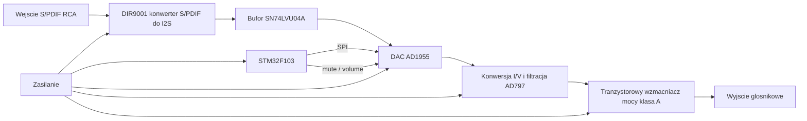

# Wzmacniacz audio 3 W z wejściem S/PDIF i DAC

## Spis treści

1. [Opis projektu](#opis-projektu)
2. [Najważniejsze parametry](#najważniejsze-parametry)
3. [Architektura systemu](#architektura-systemu)
4. [Główne bloki funkcjonalne](#główne-bloki-funkcjonalne)
5. [Wyniki symulacji](#wyniki-symulacji)
6. [PCB i pliki projektowe](#pcb-i-pliki-projektowe)
7. [Struktura dokumentacji](#struktura-dokumentacji)
8. [Co pokazuje ten projekt](#co-pokazuje-ten-projekt)
9. [Status projektu](#status-projektu)

## Opis projektu

Repozytorium dokumentuje projekt **wzmacniacza audio z wejściem cyfrowym S/PDIF, przetwornikiem DAC AD1955 oraz tranzystorową końcówką mocy**. Projekt obejmuje tor cyfrowy, tor analogowy, stopień mocy, zasilanie, symulacje LTspice oraz projekt PCB wykonany w Altium Designer.

Założeniem było stworzenie układu, który odbiera sygnał cyfrowy audio przez wejście koaksjalne S/PDIF, konwertuje go do formatu I2S, przetwarza w DAC na sygnał analogowy, a następnie wzmacnia w tranzystorowej końcówce mocy.

Projekt jest dobrym przykładem połączenia elektroniki analogowej, cyfrowej, audio, symulacji oraz projektowania PCB.

## Najważniejsze parametry

| Parametr | Wartość / założenie |
|---|---|
| Typ urządzenia | wzmacniacz audio z wejściem cyfrowym |
| Wejście audio | koaksjalne S/PDIF |
| Konwersja S/PDIF -> I2S | DIR9001 |
| DAC | AD1955 |
| Konwersja I/V | wzmacniacze operacyjne AD797 |
| Sterowanie | mikrokontroler STM32F103, SPI |
| Stopień mocy | tranzystorowy, klasa A, topologia inspirowana Linsley-Hood 1969 |
| Tranzystory mocy | MJL4281AG |
| Tranzystory driverów | BD139 |
| Tranzystory pomocnicze | BC557C |
| Założona moc wyjściowa | powyżej 3 W |
| Wynik symulacji mocy | ok. 12,9 W RMS dla obciążenia 8 ohm |
| Pasmo z symulacji | ok. 11,14 Hz - 5,18 MHz |
| Wzmocnienie napięciowe | ok. 16,25 V/V, czyli 24,22 dB przy 1 kHz |
| THD z symulacji | ok. 4,22E-03 |
| Sprawność z symulacji | ok. 25,32% |
| Zasilanie stopnia mocy | +36 V |
| Zasilanie analogowe | symetryczne +/-12 V |
| Zasilanie pomocnicze | +/-5 V oraz +3,3 V |
| Projekt PCB | Altium Designer |
| Symulacje | LTspice |

## Architektura systemu

## Główne bloki funkcjonalne

| Blok | Opis | Dokumentacja |
|---|---|---|
| Konwerter S/PDIF -> I2S | odbiór cyfrowego sygnału audio i konwersja do I2S | [docs/03_tor_cyfrowy_spdif_i2s.md](docs/03_tor_cyfrowy_spdif_i2s.md) |
| DAC i tor analogowy | AD1955, konwersja I/V, filtracja i buforowanie | [docs/04_dac_tor_analogowy.md](docs/04_dac_tor_analogowy.md) |
| Mikrokontroler | sterowanie DAC przez SPI, mute, regulacja głośności | [docs/07_mcu_sterowanie.md](docs/07_mcu_sterowanie.md) |
| Wzmacniacz mocy | tranzystorowa końcówka mocy w klasie A | [docs/05_wzmacniacz_mocy.md](docs/05_wzmacniacz_mocy.md) |
| Zasilanie | +36 V, +/-12 V, +/-5 V, +3,3 V | [docs/06_zasilanie.md](docs/06_zasilanie.md) |
| PCB | projekt w Altium, rozmieszczenie bloków, Gerbery | [docs/09_pcb_altium.md](docs/09_pcb_altium.md) |
| Symulacje | LTspice, pasmo, wzmocnienie, moc, THD, sprawność | [docs/08_symulacje_ltspice.md](docs/08_symulacje_ltspice.md) |

## Wyniki symulacji

| Badanie | Wynik |
|---|---|
| Pasmo przenoszenia | ok. 11,14 Hz - 5,18 MHz |
| Wzmocnienie napięciowe | ok. 16,25 V/V |
| Wzmocnienie w dB | ok. 24,22 dB |
| Moc RMS | ok. 12,9 W |
| THD | ok. 4,22E-03 |
| Sprawność | ok. 25,32% |

Szczegóły znajdują się w pliku [docs/08_symulacje_ltspice.md](docs/08_symulacje_ltspice.md).

## PCB i pliki projektowe

Projekt PCB wykonano w **Altium Designer**. W repozytorium znajdują się pliki projektu, pliki wyjściowe oraz Gerbery.

Najważniejsze katalogi źródłowe:

| Katalog | Zawartość |
|---|---|
| `pcb/` | projekt PCB Altium Designer |
| `pcb/Gerber/` | pliki produkcyjne Gerber |
| `sym/` | symulacje LTspice |
| `sprawozdanie/` | sprawozdanie projektowe |
| `prezentacja/` | prezentacja projektu |
| `literatura/` | noty katalogowe komponentów |

## Struktura dokumentacji

| Plik | Zawartość |
|---|---|
| [docs/00_spis_tresci.md](docs/00_spis_tresci.md) | pełny spis dokumentacji |
| [docs/01_architektura.md](docs/01_architektura.md) | architektura systemu |
| [docs/02_parametry_projektu.md](docs/02_parametry_projektu.md) | parametry i założenia |
| [docs/03_tor_cyfrowy_spdif_i2s.md](docs/03_tor_cyfrowy_spdif_i2s.md) | DIR9001, S/PDIF, I2S |
| [docs/04_dac_tor_analogowy.md](docs/04_dac_tor_analogowy.md) | AD1955 i tor analogowy |
| [docs/05_wzmacniacz_mocy.md](docs/05_wzmacniacz_mocy.md) | końcówka mocy klasy A |
| [docs/06_zasilanie.md](docs/06_zasilanie.md) | moduł zasilania |
| [docs/07_mcu_sterowanie.md](docs/07_mcu_sterowanie.md) | sterowanie mikrokontrolerem |
| [docs/08_symulacje_ltspice.md](docs/08_symulacje_ltspice.md) | wyniki symulacji |
| [docs/09_pcb_altium.md](docs/09_pcb_altium.md) | projekt PCB |
| [docs/10_bom_komponenty.md](docs/10_bom_komponenty.md) | elementy i ich rola |
| [docs/11_testy_walidacja.md](docs/11_testy_walidacja.md) | testy i walidacja |
| [docs/12_portfolio.md](docs/12_portfolio.md) | opis projektu do CV |
| [docs/13_todo_przed_publikacja.md](docs/13_todo_przed_publikacja.md) | lista poprawek przed publikacją |

## Co pokazuje ten projekt

Projekt pokazuje praktyczne umiejętności z zakresu:

- projektowania torów audio,
- doboru elementów analogowych i cyfrowych,
- projektowania wzmacniaczy tranzystorowych,
- pracy z układami DAC i interfejsem I2S,
- sterowania układami audio przez SPI,
- symulacji w LTspice,
- projektowania PCB w Altium Designer,
- przygotowania dokumentacji technicznej,
- analizy wyników: pasmo, wzmocnienie, moc, THD i sprawność.

## Status projektu

Projekt zawiera dokumentację, symulacje LTspice, schematy, PCB i Gerbery. Przed traktowaniem go jako gotowy produkt sprzętowy należy jeszcze wykonać weryfikację prototypu, pomiary laboratoryjne, kontrolę termiczną końcówki mocy oraz końcową walidację PCB.

## Autor

**Maciej Molik**
