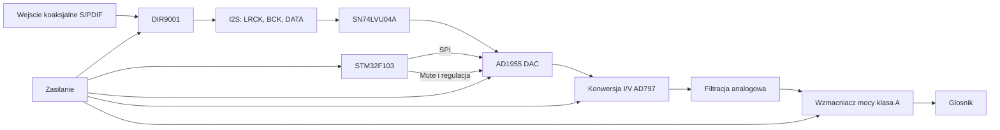

# Architektura systemu

## Cel architektury

Projekt składa się z kilku bloków funkcjonalnych połączonych w jeden tor audio. Sygnał wejściowy jest cyfrowy, a sygnał wyjściowy jest analogowy i zasila głośnik.

## Diagram wysokiego poziomu

## Przepływ sygnału audio

1. Sygnał cyfrowy S/PDIF trafia do gniazda RCA.
2. DIR9001 dekoduje S/PDIF i odzyskuje sygnały zegarowe oraz dane audio.
3. Sygnały I2S są buforowane i kształtowane przez SN74LVU04A.
4. AD1955 zamienia dane cyfrowe PCM na sygnał analogowy prądowy.
5. Wzmacniacze operacyjne AD797 realizują konwersję prąd-napięcie oraz filtrację.
6. Tranzystorowy stopień mocy wzmacnia sygnał do poziomu odpowiedniego dla głośnika.
7. Moduł zasilania dostarcza oddzielne napięcia dla części cyfrowej, analogowej i mocy.

## Podział na domeny

| Domena | Bloki |
|---|---|
| Cyfrowa | S/PDIF, DIR9001, SN74LVU04A, STM32F103, SPI |
| Konwersja C/A | AD1955 |
| Analogowa niskosygnałowa | konwersja I/V, AD797, filtracja |
| Moc | końcówka tranzystorowa, MJL4281AG, BD139, BC557C |
| Zasilanie | prostowniki, stabilizatory, kondensatory, separacja mas |

## Dlaczego taki podział jest ważny

W projekcie audio trzeba ograniczać przenikanie zakłóceń z części cyfrowej do analogowej. Dlatego istotny jest podział funkcjonalny, oddzielenie ścieżek zasilania, odpowiednie prowadzenie mas oraz logiczne rozmieszczenie bloków na PCB.
