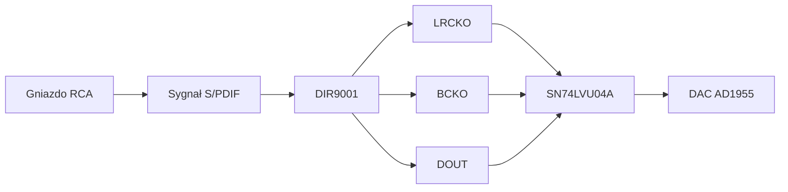

# Tor cyfrowy S/PDIF -> I2S

## Cel modułu

Moduł cyfrowy odbiera sygnał audio w standardzie S/PDIF i przygotowuje go do dalszej konwersji w przetworniku AD1955. Kluczowym zadaniem jest odzyskanie danych PCM oraz sygnałów zegarowych.

## Elementy modułu

| Element | Rola |
|---|---|
| DIR9001 | odbiornik S/PDIF i konwerter do I2S |
| SN74LVU04A | buforowanie i kształtowanie sygnałów logicznych |
| RCJ-043 | gniazdo RCA dla wejścia koaksjalnego |
| Kwarc 24,576 MHz | źródło zegara dla odbiornika cyfrowego |

## Przepływ sygnału

## Rola DIR9001

DIR9001 dekoduje sygnał S/PDIF, odzyskuje zegar przez PLL i generuje sygnały zgodne z interfejsem audio I2S. Dzięki temu układ DAC może otrzymać dane PCM w formacie możliwym do konwersji na sygnał analogowy.

## Rola SN74LVU04A

SN74LVU04A pełni rolę bufora i układu poprawiającego zbocza sygnałów logicznych. Jest to ważne, ponieważ sygnały zegarowe I2S mają duży wpływ na jakość konwersji cyfrowo-analogowej.
