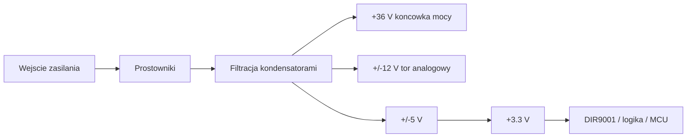
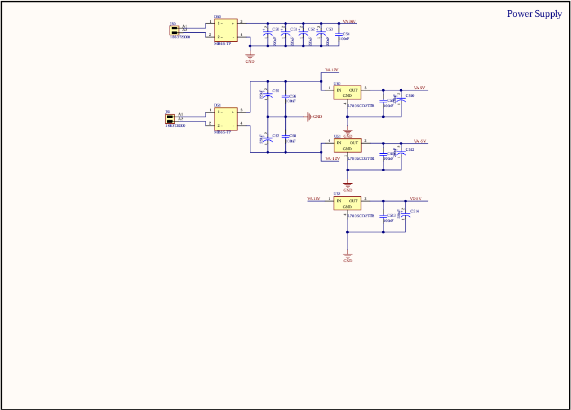

# Moduł zasilania

## Cel modułu

Moduł zasilania dostarcza stabilne napięcia dla części cyfrowej, analogowej oraz końcówki mocy. W projekcie występuje kilka domen zasilania, ponieważ różne bloki wymagają różnych napięć i poziomów zakłóceń.

## Napięcia w projekcie

| Napięcie | Zastosowanie |
|---|---|
| +36 V | końcówka mocy |
| +/-12 V | wzmacniacze operacyjne w torze analogowym |
| +5 V | część cyfrowa i pomocnicza |
| -5 V | wybrane obwody analogowe |
| +3,3 V | układy cyfrowe wymagające niższego napięcia |

## Elementy modułu

| Element | Rola |
|---|---|
| MB6S | mostki prostownicze |
| Kondensatory elektrolityczne | filtracja napięcia po prostowaniu |
| L7805 | stabilizacja +5 V |
| L7905 | stabilizacja -5 V |
| REG1117-3.3 | stabilizacja +3,3 V |
| Dławiki ferrytowe | ograniczenie zakłóceń i separacja domen |

## Diagram zasilania

## Uwagi projektowe

W torze audio zasilanie ma bezpośredni wpływ na szumy i stabilność pracy. Należy dbać o krótkie ścieżki prądowe, separację masy analogowej i cyfrowej oraz odpowiednią filtrację przy każdym układzie scalonym.

## Schemat ze sprawozdania

