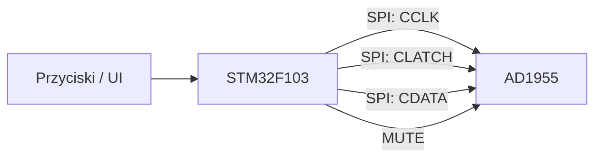

# Mikrokontroler i sterowanie

## Cel modułu

Mikrokontroler odpowiada za konfigurację przetwornika AD1955 i funkcje użytkowe, takie jak regulacja głośności, mute oraz potencjalna obsługa przycisków lub LED.

## Zakładany mikrokontroler

W dokumentacji projektu pojawia się mikrokontroler **STM32F103**. Jego główną rolą jest sterowanie układem DAC przez SPI.

## Funkcje sterowania

| Funkcja | Opis |
|---|---|
| Konfiguracja DAC | ustawienie formatu danych i trybu pracy AD1955 |
| Regulacja głośności | zapis wartości do rejestrów głośności DAC |
| Mute | wyciszenie sygnału audio |
| De-emfaza | opcjonalna konfiguracja trybu DAC |
| Interfejs użytkownika | potencjalne przyciski, enkoder lub LED |

## Diagram sterowania

## Możliwa sekwencja startowa

1. Inicjalizacja zasilania i zegarów.
2. Reset lub ustawienie stanu początkowego DAC.
3. Konfiguracja formatu wejściowego.
4. Ustawienie poziomu głośności.
5. Wyłączenie mute po stabilizacji toru audio.

## Możliwe rozszerzenia

- enkoder do regulacji głośności,
- diody LED statusu,
- wybór źródła sygnału,
- zapamiętywanie ustawień,
- interfejs użytkownika z wyświetlaczem.
