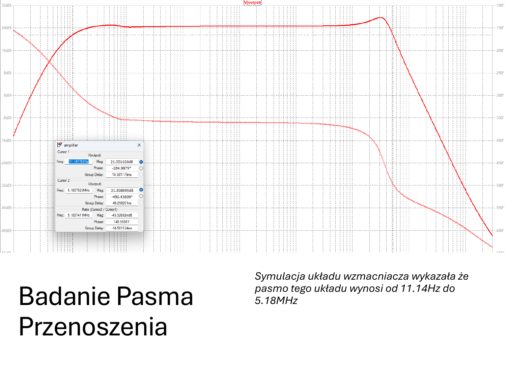
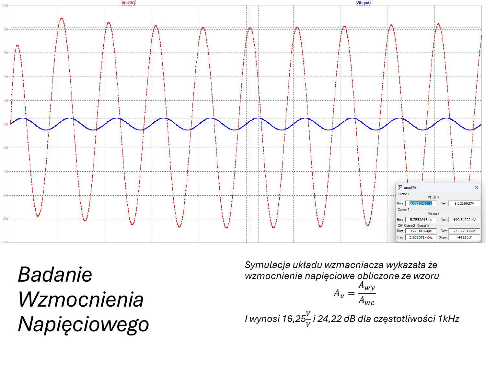
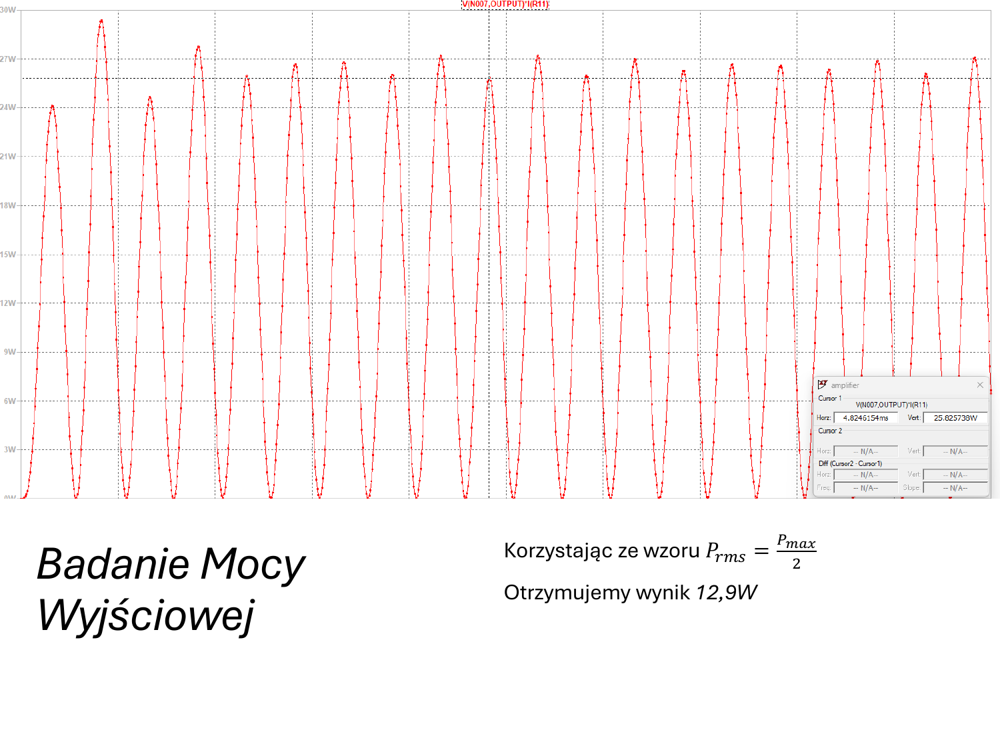
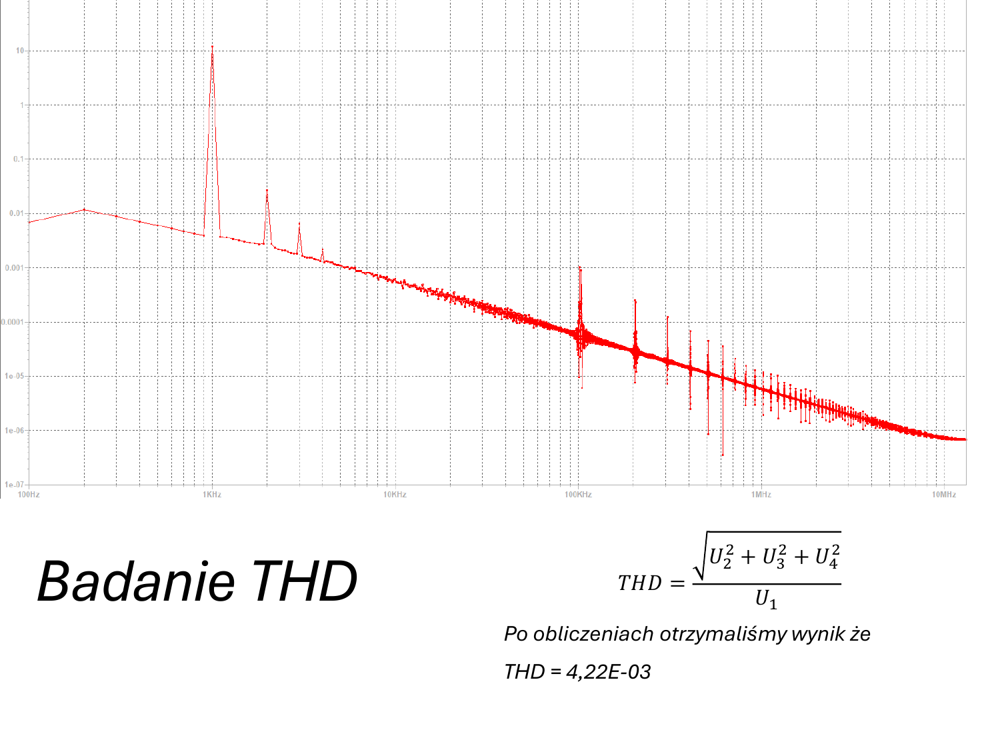
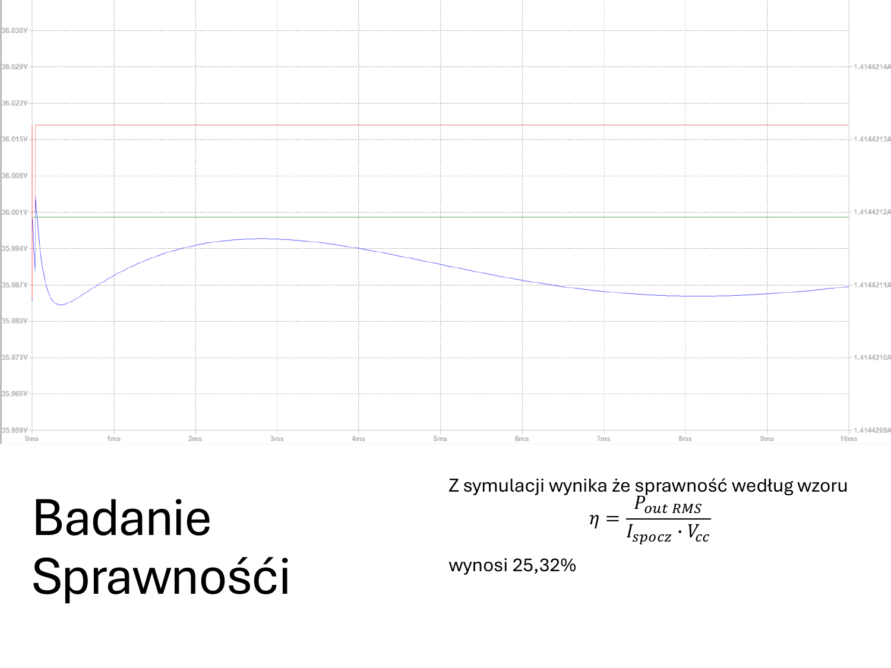

# Symulacje LTspice

## Cel symulacji

Symulacje służą do weryfikacji działania wzmacniacza mocy i zasilania przed wykonaniem lub uruchomieniem prototypu. W projekcie znajdują się pliki LTspice:

| Plik | Znaczenie |
|---|---|
| `sym/amplifier.asc` | symulacja końcówki mocy |
| `sym/Power supply.asc` | symulacja zasilania |

## Wyniki

| Badanie | Wynik |
|---|---|
| Pasmo przenoszenia | ok. 11,14 Hz - 5,18 MHz |
| Wzmocnienie napięciowe | ok. 16,25 V/V |
| Wzmocnienie w dB | ok. 24,22 dB |
| Moc RMS | ok. 12,9 W |
| THD | ok. 4,22E-03 |
| Sprawność | ok. 25,32% |

## Wzory używane w analizie

Wzmocnienie napięciowe:

$$
A_v = \frac{V_{out}}{V_{in}}
$$

Wzmocnienie w dB:

$$
A_{v,dB} = 20 \log_{10}(A_v)
$$

Moc na obciążeniu:

$$
P_{RMS} = \frac{V_{RMS}^2}{R}
$$

THD:

$$
THD = \frac{\sqrt{U_2^2 + U_3^2 + U_4^2 + ...}}{U_1}
$$

Sprawność:

$$
\eta = \frac{P_{out,RMS}}{I_{spocz} \cdot V_{CC}}
$$

## Zrzuty z symulacji

### Pasmo przenoszenia

### Wzmocnienie

### Moc wyjściowa

### THD

### Sprawność

## Interpretacja

Symulacje wskazują, że projekt przekracza założenie mocy wyjściowej powyżej 3 W. Należy jednak pamiętać, że rzeczywisty układ wymaga pomiarów laboratoryjnych, szczególnie w zakresie temperatury, zniekształceń i stabilności punktu pracy.
