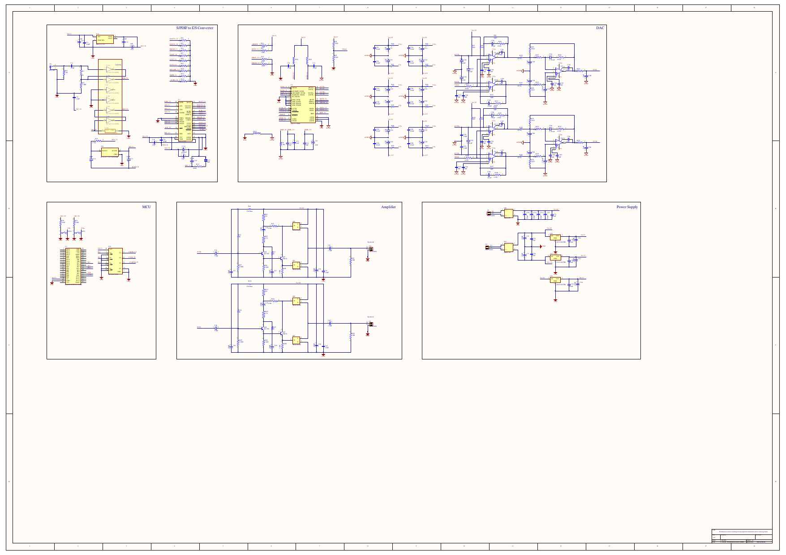
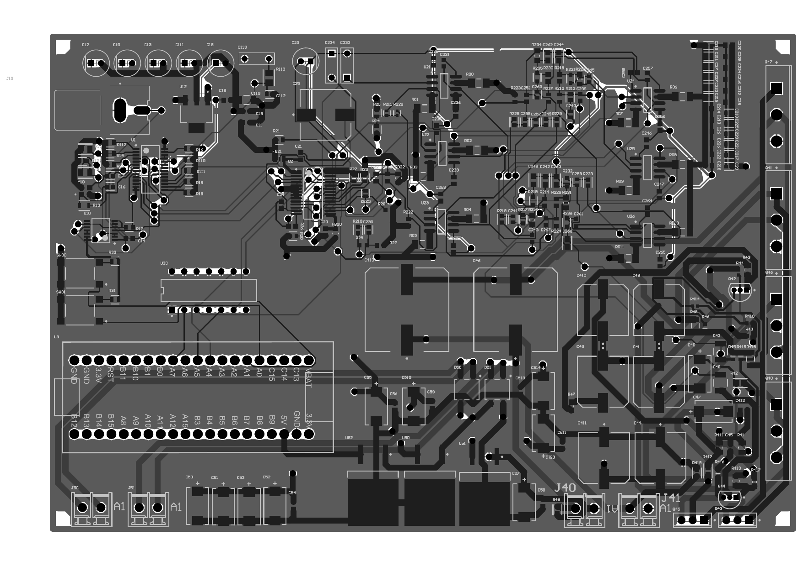
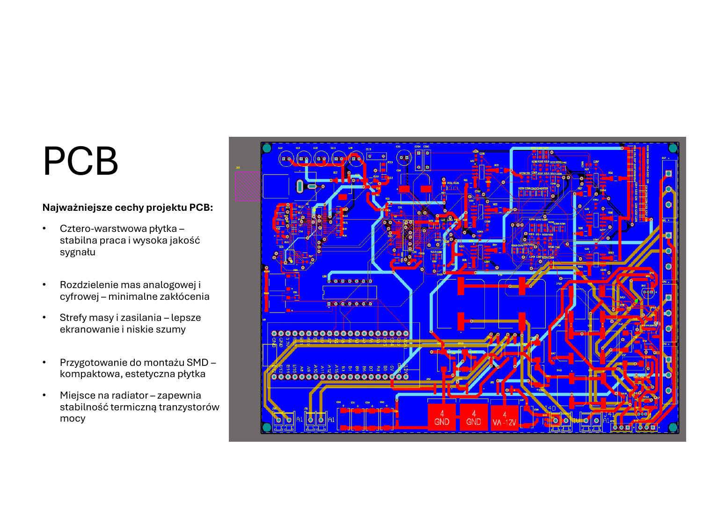

# Projekt PCB w Altium Designer

## Cel projektu PCB

Celem PCB było połączenie części cyfrowej, analogowej, zasilania i końcówki mocy w jednym projekcie. Płytka musi uwzględniać zarówno sygnały cyfrowe o wysokich zboczach, jak i niskoszumowy tor analogowy.

## Pliki projektowe

| Plik / katalog | Opis |
|---|---|
| `pcb/PCB_Project.PrjPcb` | projekt Altium |
| `pcb/Wzmacniacz audio.SchDoc` | schemat ideowy |
| `pcb/PCB_wzmacniacz_audio.PcbDoc` | projekt płytki |
| `pcb/Gerber/` | pliki produkcyjne |
| `pcb/Project Outputs for PCB_Project/` | wygenerowane pliki wyjściowe |
| `pcb/PCB_Project.pdf` | eksport projektu do PDF |

## Założenia PCB

- oddzielenie sekcji cyfrowej i analogowej,
- krótkie ścieżki dla sygnałów I2S,
- odpowiednio szerokie ścieżki zasilania i stopnia mocy,
- sensowne rozmieszczenie złączy,
- miejsce na elementy większej mocy i potencjalne radiatory,
- ograniczenie pętli masy,
- filtracja przy układach scalonych.

## Podgląd projektu

### Schemat z Altium

### PCB

### Widok z prezentacji

## Rzeczy do sprawdzenia przed produkcją

- DRC w Altium,
- szerokości ścieżek prądowych,
- odstępy izolacyjne,
- termika tranzystorów mocy,
- prowadzenie mas analogowych i cyfrowych,
- poprawność footprintów,
- polaryzacje kondensatorów i diod,
- zgodność Gerberów z projektem.
